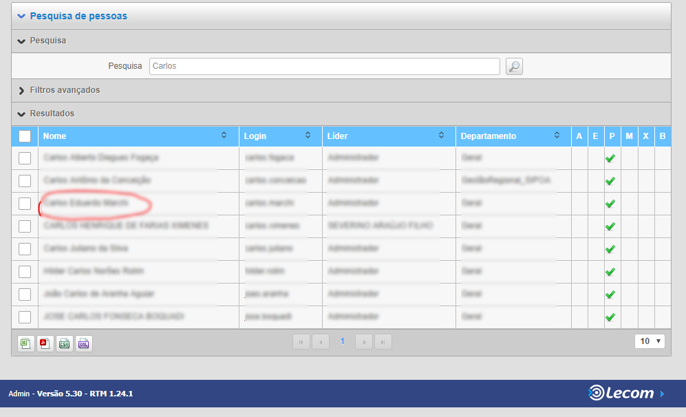
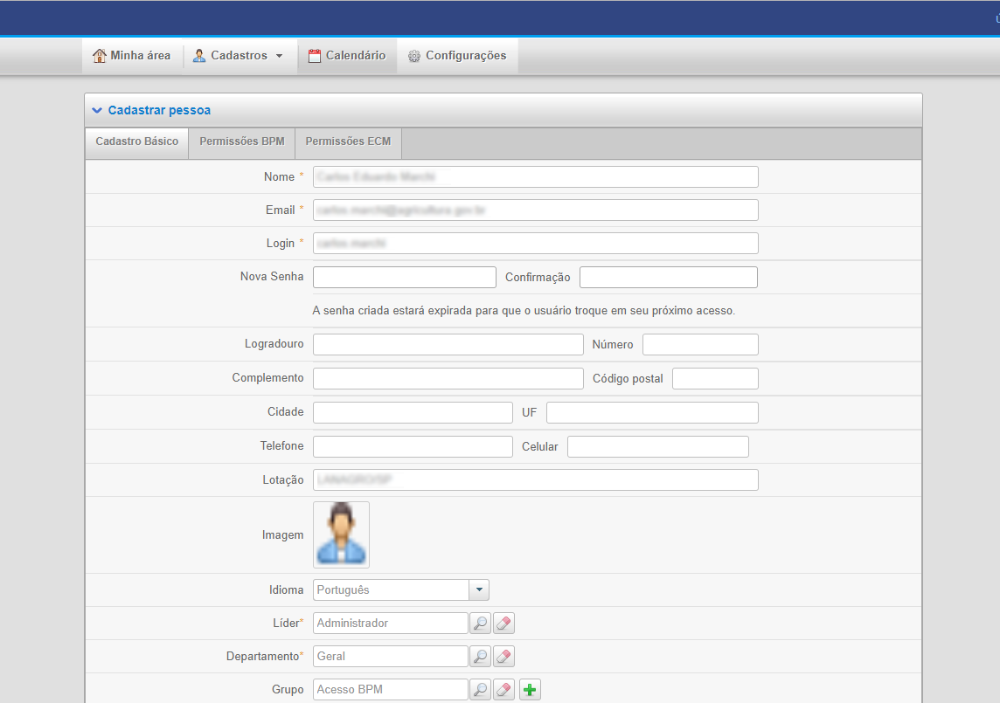

.. Manual de Gestão de Usuários documentation master file, created by
   sphinx-quickstart on Wed Feb 20 08:36:05 2019.
   You can adapt this file completely to your liking, but it should at least
   contain the root `toctree` directive.

Como atualizo o cadastro do usuário?
====================================

Clique no nome para alterar o cadastro, conforme imagem abaixo:

A seguir, tela com os dados do usuário será exibida, conforme imagem abaixo:

   