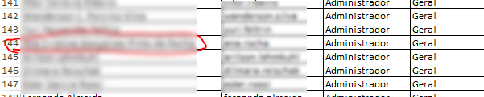
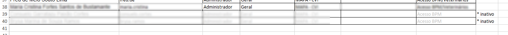
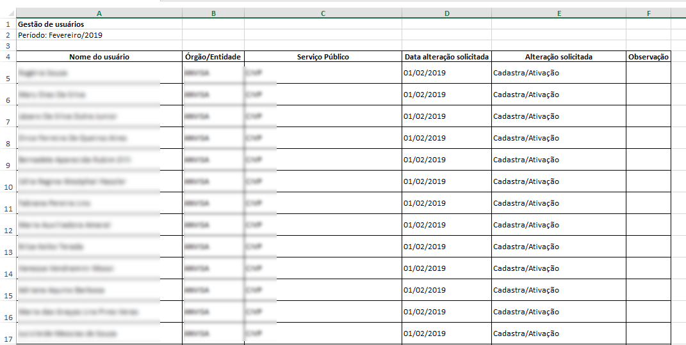
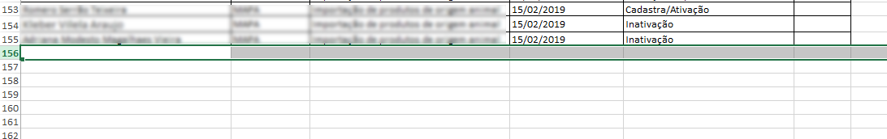

.. Manual de Gestão de Usuários documentation master file, created by
   sphinx-quickstart on Wed Feb 20 08:36:05 2019.
   You can adapt this file completely to your liking, but it should at least
   contain the root `toctree` directive.

Atualização das planilhas auxiliares
====================================

Após realizar qualquer operação relacionada à gestão de usuários, é **indispensável** que se atualize a planilha de acompanhamento da respectiva instância (Órgão) o qual se realizou os procedimentos de gestão e a planilha de controle de usuários por mês.

Arquivos disponíveis em: **L:\\5 - DESPD\\TRANSFORMACAODIGITAL\\07 . Gestão de Usuários\\**

Atualização da planilha referente à instância (Órgão)
-----------------------------------------------------
   
Abra o arquivo referente à instância (Órgão) referente aos procedimentos que acabou de realizar a gestão de usuários. Vamos abrir a planilha de controle do Ministério da Agricultura, Pecuária e Abastecimento **(MAPA)** por exemplo.

   
A figura abaixo exibe a planilha aberta:

   
O próximo passo é identificar o serviço o qual foi realizado o procedimento a ser registrado na planilha. Para isso, clique na aba referente ao serviço desejado. No exemplo abaixo vamos selecionar a aba do serviço **Credenciamento de Laboratórios**:

   
A seguinte tela é exibida:

   
Em seguida, verifique se o usuário cadastrado já existe na planilha. Pesquise pelo nome ou parte do nome do usuário em toda a planilha. Lembre de escolher a opção **"pasta de trabalho"** nas opções de pesquisa.

   
Caso não tenha encontrado nenhuma ocorrência do nome inclua uma nova linha ao final da planilha.

   
Caso contrário atualize a linha existente.

No caso da inativação de usuários, acrescente a legenda **"* inativo"** ao final da linha e utilize uma cor cinza para o texto, conforme imagem a seguir:
   

Insira os dados da operação realizada, salve o arquivo e Pronto!   

Atualização da planilha de controle de usuários por mês
-------------------------------------------------------

Abra o arquivo que contém a planilha de controle de usuários por mês.

   
A figura abaixo exibe a planilha aberta:

   
**Sempre** inclua uma nova linha ao final da planilha.

   
Insira os dados da operação realizada, salve o arquivo e Pronto!