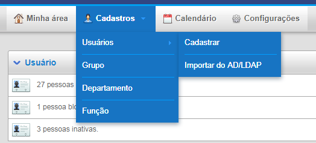
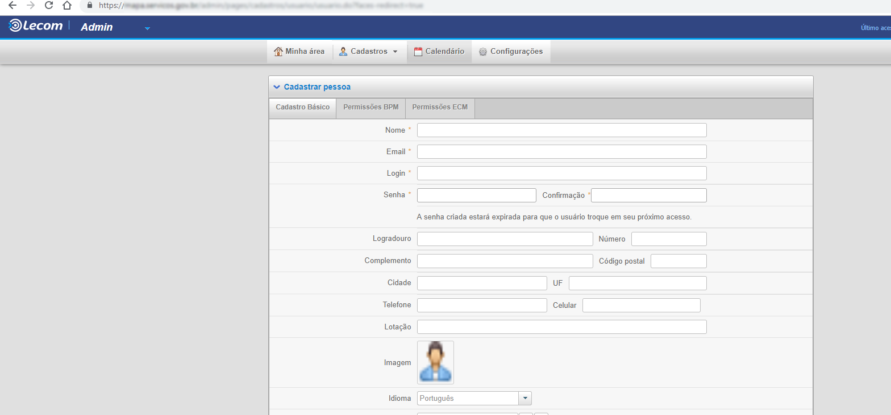
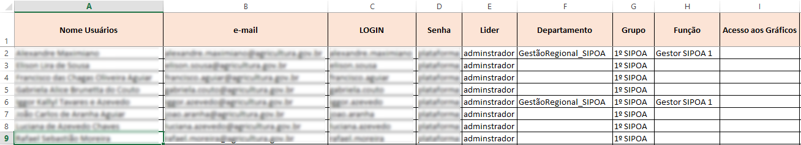
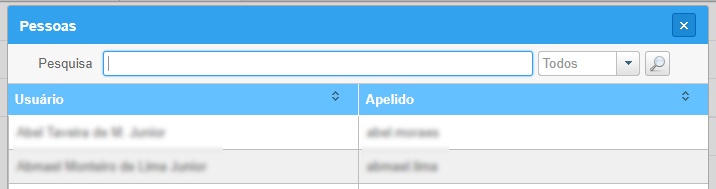

.. Manual de Gestão de Usuários documentation master file, created by
   sphinx-quickstart on Wed Feb 20 08:36:05 2019.
   You can adapt this file completely to your liking, but it should at least
   contain the root `toctree` directive.

Como cadastrar um novo usuário?
===============================

Após ter efetuado o login no item anterior, na tela inicial acesse a opção “Admin”, conforme figura abaixo:

.. figure:: _imagens/tela7.png
   :scale: 100 %
   :align: center
   :alt: Cadastro de usuário.
   
A seguinte tela será exibida:

   
Após acesse a opção “Cadastros”, “Usuários” e por fim “Cadastrar”.

   
Em seguida, verifique se o usuário já existe no sistema **(importante, não pule esta etapa)**. Para isso, role a tela a seguir para baixo até que o campo de pesquisa seja exibido:

   
Digite parte do nome do usuário a ser cadastrado e clique na lupa ao lado do campo para realizar a pesquisa. Verifique se o usuário já existe, conforme imagem abaixo:

   
Caso o usuário não exista, proceda o cadastro normalmente devendo clicar no botão “novo”, conforme imagem abaixo. No caso de existência do usuário, siga o os passos do item “3. Como atualizo as permissões de um usuário?” deste manual.

   
A imagem a seguir apresenta um exemplo de planilha para preenchimento dos campos de cadastro:

Esta planilha será disponibilizada a você pelo Analista que acompanha a automação do serviço. A seguir entre com as informações do usuário:

   
**Observação:** Como prática no cadastramento dos usuários definimos **nome.sobrenome** conforme endereço de e-mail informado. 
No campo “senha” e no campo “Confirmação”, utilize a senha padrão: **plataforma**
A senha será trocada obrigatoriamente quando o usuário realizar o primeiro acesso.
Preencha os campos “Lider”, “Departamento”, “Grupo” e “Função”, conforme planilha fornecida:

   
Para preencher os campos acima clique na lupa ao lado do campo desejado:

.. figure:: _imagens/tela16.png
   :scale: 100 %
   :align: center
   :alt: Cadastro de usuário.
   
A seguir será exibida tela para seleção do conteúdo do campo a ser preenchido:

   
**Observação:** caso o usuário pertença a dois ou mais grupos ou funções, clique no botão “+” para adicionar novos campos.

   

   
O botão “-“ exclui opções e o botão “borracha” apaga o conteúdo do campo.

**Importante:** sempre incua o grupo “Acesso BPM” para todos os usuários.

   
Em seguida, marque a opção, conforme imagem abaixo:

   
A seguir, na aba “Permissões BPM” deixe selecionada a opção “Parcial”.

   
Em seguida clique no botão “Salvar”.

   
Por fim, selecione o serviço e informe a senha **ALIAS** disponível no link:
https://docs.google.com/spreadsheets/d/18wc7CIPdDciXYgYxwq995TsMwmQ4SsnFyHrwEX7cYwg/edit?ts=5c1a3897#gid=0
