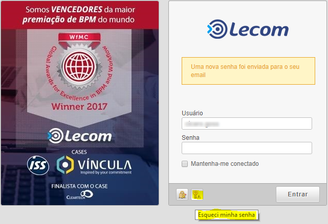
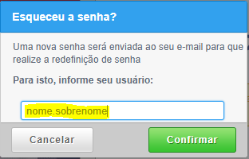

.. Manual de Gestão de Usuários documentation master file, created by
   sphinx-quickstart on Wed Feb 20 08:36:05 2019.
   You can adapt this file completely to your liking, but it should at least
   contain the root `toctree` directive.

Usuário não recebeu e-mail com a senha ou esqueceu a senha?
===============================

Orientar o usuário acessar a instância de atendimento do serviço.

Clique em 

   
Ao localizar o cadastro basta ir na segunda aba de “Permissões BPM”.

Logo depois que clicar na aba Permissões BPM, selecionar as opções em amarelo abaixo.