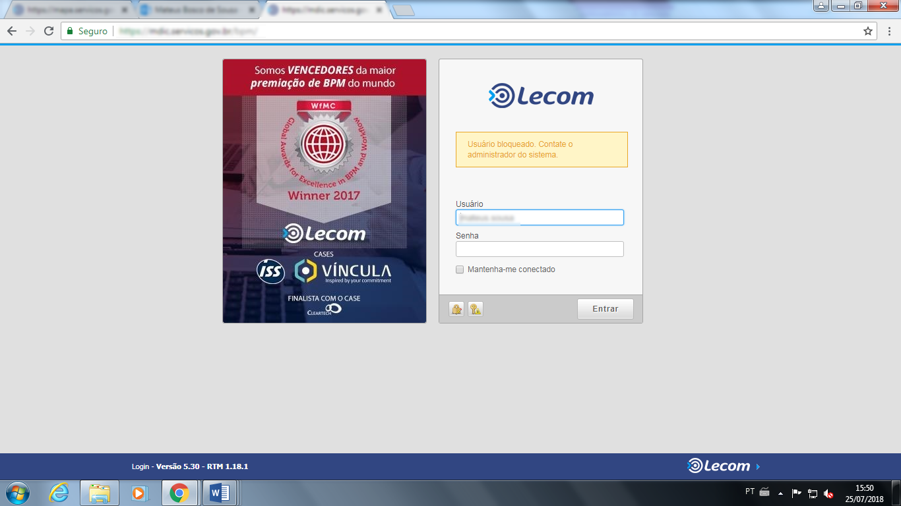
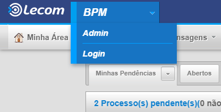
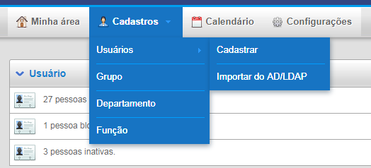
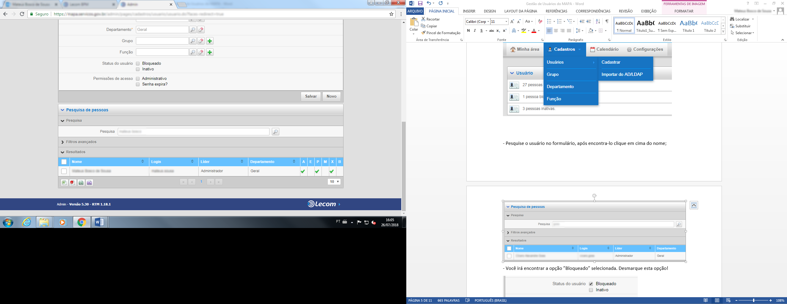
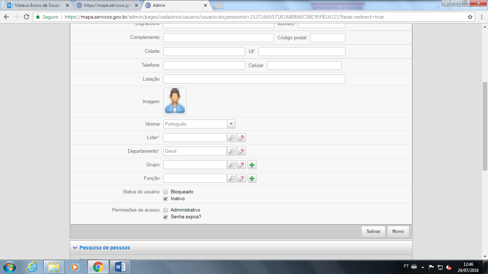
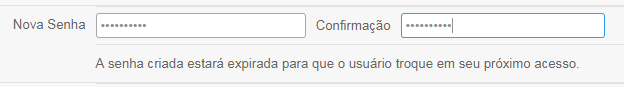

.. Manual de Gestão de Usuários documentation master file, created by
   sphinx-quickstart on Wed Feb 20 08:36:05 2019.
   You can adapt this file completely to your liking, but it should at least
   contain the root `toctree` directive.

Como inativo um usuário?
===============================

Geralmente um usuário é inativado após quatro tentativas de acesso com a senha errada. Ao realizar o login o usuário encontra a seguinte mensagem.

Acesse o endereço http://mapa.servicos.gov.br e entre com seu usuário e senha.

Na tela inicial acesse a opção “Admin”.

   
Após acesse a opção “Cadastros”, “Usuários” e por fim “Cadastrar”.

   
Pesquise o usuário no formulário, após encontra-lo clique em cima do nome.

   
Você irá encontrar a opção ”INATIVO” selecionada. Desmarque esta opção!

   
Provavelmente o usuário foi inativo, porque a senha foi esquecida. Redefina a senha para **plataforma**. A senha será trocada obrigatoriamente quando o usuário realizar o primeiro acesso.

   
Clique em “Salvar” e pronto!