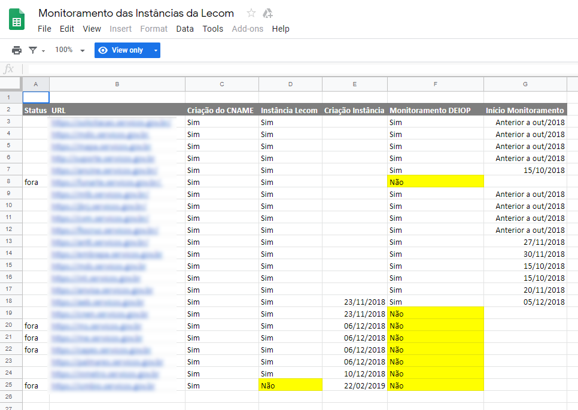
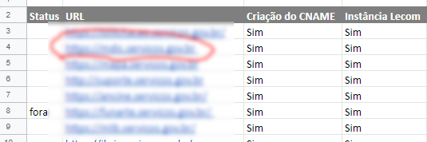
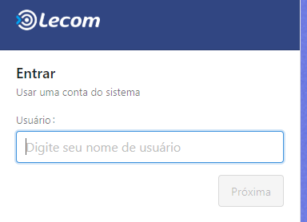
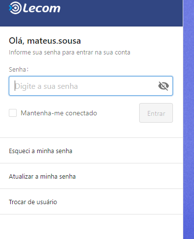
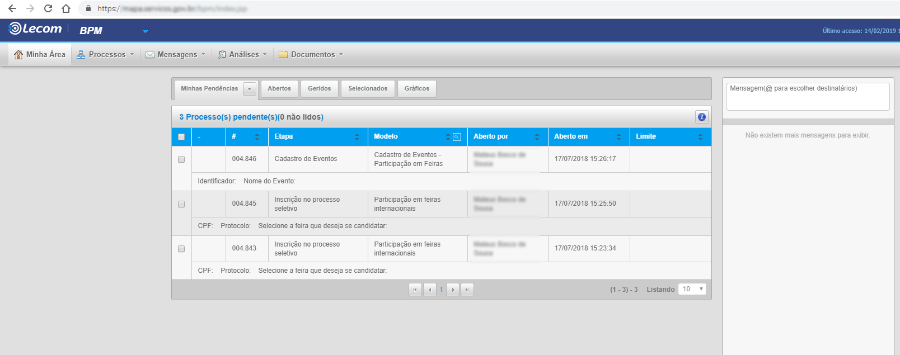

.. Manual de Gestão de Usuários documentation master file, created by
   sphinx-quickstart on Wed Feb 20 08:36:05 2019.
   You can adapt this file completely to your liking, but it should at least
   contain the root `toctree` directive.

Como acessar uma Instância de um Órgão?
===============================

- Acesse o endereço https://docs.google.com/spreadsheets/d/10-Rs8QFSvZrVHfbVO_oQYjEg8cFJfbz5tIROn5EhZiQ/edit#gid=770060652

A seguinte tela será exibida contendo todas as instâncias de atendimento dos Órgãos:

   
|
Em seguida acesse o link da instância desejada contido na planilha. Para isso, clique no link da planilha, conforme exemplo abaixo:

   
|
A seguir, a tela da instância será exibida, conforme imagem abaixo:

   
|
Agora você deverá efetuar o login. Para isso, informe o nome de usuário, conforme exemplo abaixo:

   
|
O próximo passo é informar a senha de acesso, conforme imagem abaixo:

   
|
Após a realização de login com sucesso, a seguinte tela será exibida:

