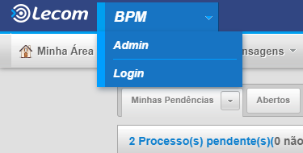

.. Manual de Gestão de Usuários documentation master file, created by
   sphinx-quickstart on Wed Feb 20 08:36:05 2019.
   You can adapt this file completely to your liking, but it should at least
   contain the root `toctree` directive.

Como faço para ter acesso ao módulo studío?
===============================

Acesse a instância, conforme item "Como acessar uma Instância de um Órgão?" deste manual e entre com seu usuário e senha.

Em seguida, na tela inicial acesse a opção “Admin”.

Após acesse a opção “Cadastros”, “Usuários” e por fim “Cadastrar”.

.. figure:: _imagens/tela39.png
   :scale: 70 %
   :align: center
   :alt: Acesso ao módulo stúdio.
   
Pesquise o usuário no formulário, após encontra-lo clique em cima do nome.

   
Ao localizar tal cadastro basta ir na segunda aba de “Permissões BPM” .

   
Logo depois que clicar na aba Permissões BPM, você irá em “permissões de alteração”, e marca a opção “modelos”, assim que marca a opção modelos basta sair da página e fazer login novamente que terá acesso ao “módulo studio”.

   
Clique em “Salvar” e pronto!