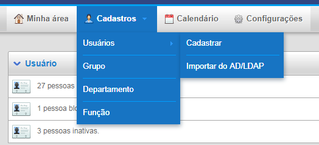
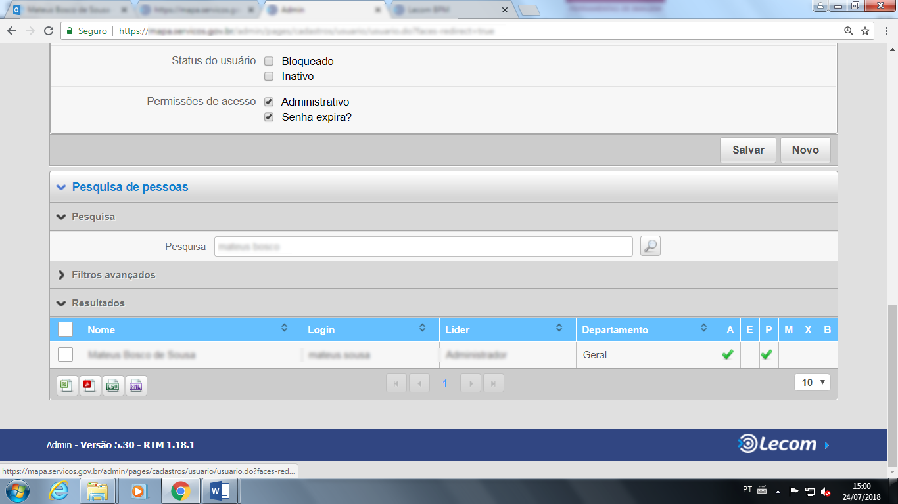
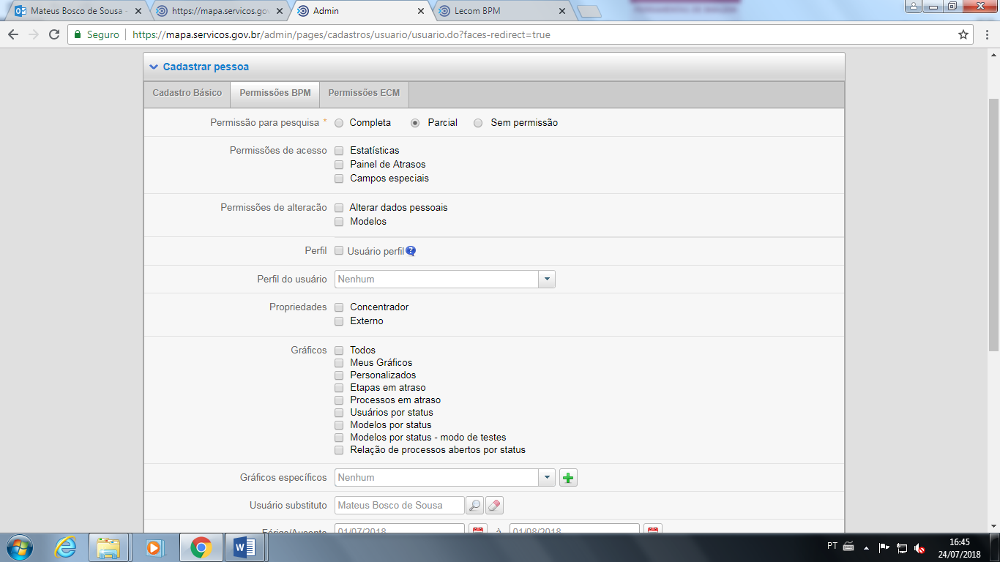
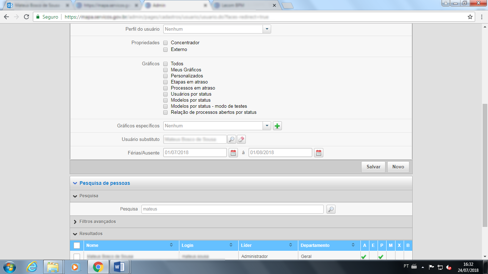

.. Manual de Gestão de Usuários documentation master file, created by
   sphinx-quickstart on Wed Feb 20 08:36:05 2019.
   You can adapt this file completely to your liking, but it should at least
   contain the root `toctree` directive.

Como cadastro um atendente substituto durante um período de ausência/férias?
===============================

Acesse a instância, conforme item "Como acessar uma Instância de um Órgão?" deste manual e entre com seu usuário e senha.

Na tela inicial acesse a opção “Admin”.

.. figure:: _imagens/tela43.png
   :scale: 70 %
   :align: center
   :alt: Cadastro um atendente substituto.
   
Após acesse a opção “Cadastros”, “Usuários” e por fim “Cadastrar”.

   
Pesquise o nome do usuário que ficara Férias/Ausente, após encontra-lo clique em cima do nome.

   
Ao localizar tal cadastro basta ir na segunda aba de “Permissões BPM”.

   
Logo depois que clicar na aba Permissões BPM , você poderá informa o Usuário substituto e logo em seguida você informa o períodos de Férias/Ausente.

   
Clique em “Salvar” e pronto!