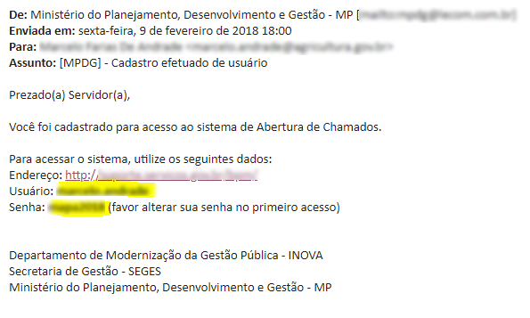
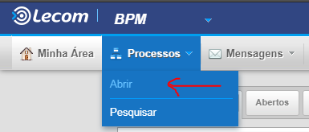
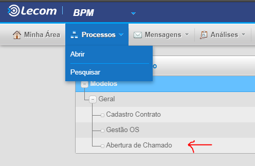
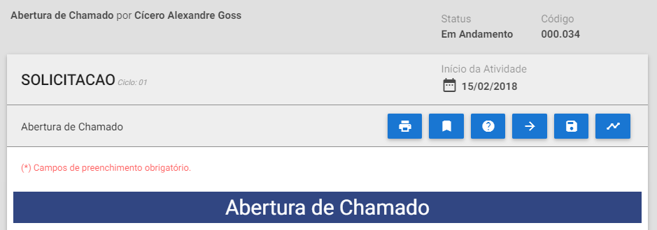
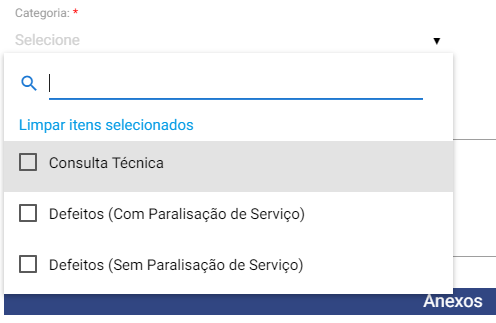
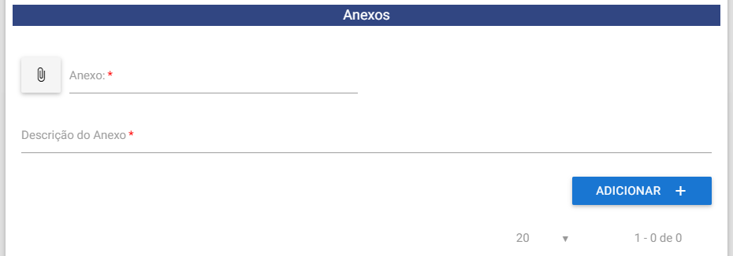
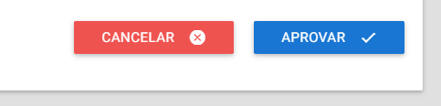
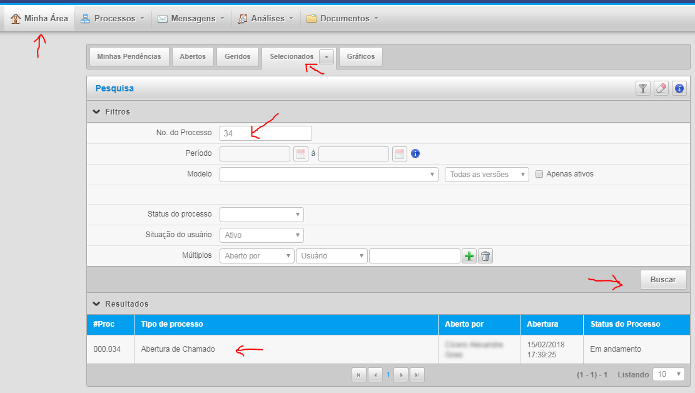
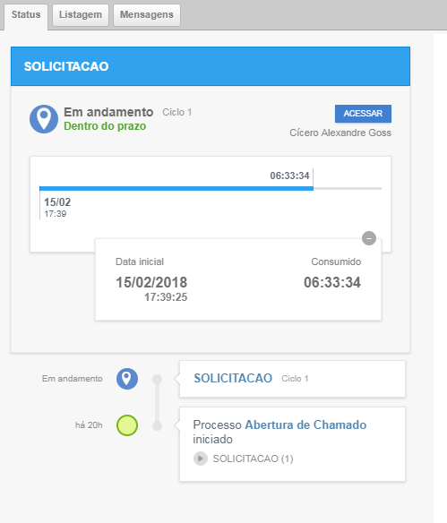

.. Manual de Gestão de Usuários documentation master file, created by
   sphinx-quickstart on Wed Feb 20 08:36:05 2019.
   You can adapt this file completely to your liking, but it should at least
   contain the root `toctree` directive.

Orientações para Abertura de Chamados de Suporte Técnico
========================================================

**Importante!** Este canal de suporte é destinado somente a questões técnicas. Dúvidas relacionadas a “regras de negócio” do atendimento deverão ser dirigidas ao gestor do serviço no seu órgão.

Ao acessar o endereço http://suporte.servicos.gov.br será mostrada no navegador de internet a tela a seguir:

.. figure:: _imagens/tela51.png
   :scale: 70 %
   :align: center
   :alt: Orientações para Abertura de Chamados de Suporte Técnico.
   
Entre com usuário e senha que foram fornecidos por e-mail:

   
Observar que:
1.	A senha deverá ser modificada no primeiro acesso;
2.	Existem dois sites disponíveis para o MAPA, um que se refere a interface de atendimento dos serviços públicos (http://mapa.servicos.gov.br) e outro que se refere a abertura de chamados de suporte técnico (http://suporte.servicos.gov.br);
3.	Você poderá utilizar a mesma senha nos dois sites para fácil memorização; e que
4.	O seu usuário será o mesmo nos dois sites.

Acesse o menu “Processos”, após clique em “Abrir.

   
A seguir, clique em “Abertura de Chamado”.

   
Preencha a sua solicitação no formulário a seguir e atenção aos seguintes itens.

 
O campo **"código"** demonstra qual será o número do chamado **[não se esqueça de anotá-lo]**.

O ícone **"fluxo vivo"** exibe o andamento do seu atendimento.

   
No campo “Categoria” informar:
**Consulta Técnica** – no caso de dúvidas em relação a utilização da ferramenta, tais como, “Minha área”, pesquisa de atendimentos, acompanhamento dos chamados, utilização do token para assinatura digital, integrações entre sistemas, etc. [solução em até 02 (duas) horas corridas após o cadastramento da demanda];

**Defeitos** (com Paralisação do Serviço) – no caso de erros apresentados pela ferramenta de solicitação de serviços que impeça a solicitação e/ou atendimento do serviço público, como por exemplo, sistema “fora do ar” [solução em até 04 (quatro) horas corridas após a identificação ou registro do defeito]; e

**Defeitos** (sem Paralisação de Serviço) – no caso de erros apresentados pela ferramenta de solicitação de serviço que não inviabilize a solicitação e/ou atendimento do serviço público [solução em até até 24 (vinte e quatro) corridas após a identificação ou registro do defeito];

**Dúvidas relacionadas a “regras de negócio” do atendimento deverão ser dirigidas ao gestor do serviço no seu órgão.**

No campo “Anexos” adicione todos os arquivos necessários para o entendimento do chamado, tais como, print de telas, PDF, arquivos utilizados na solicitação/atendimento, passo-a-passo seguido pelo usuário até encontrar o erro (contextualização do problema).

Clique no botão “Aprovar” para enviar a sua solicitação.

   
Para consultar o andamento de sua solicitação clique no ícone “Minha Área”, após “Selecionados”.

   
Informe no campo “No do Processo” o número/código do seu chamado e clique no botão “Buscar”. Por último clique em cima do seu chamado que aparece nos resultados.

Na tela que segue as seguintes opções poderão ser utilizadas:
**Status** – exibe todo o histórico do atendimento e os seus respectivos passos;
**Acessar** – exibe as informações relacionadas ao formulário de solicitação; e
**Listagem** – exibe de forma consolidada as etapas do atendimento.

   
Além desse processo todo, tem a opção de ligar diretamente no suporte da lecom.

(0800-883-6216)