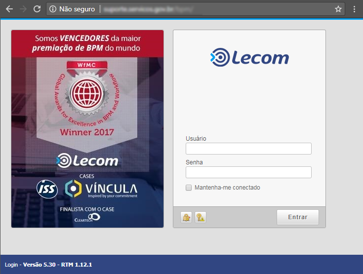

.. Manual de Gestão de Usuários documentation master file, created by
   sphinx-quickstart on Wed Feb 20 08:36:05 2019.
   You can adapt this file completely to your liking, but it should at least
   contain the root `toctree` directive.

Usuário está em dois ou mais serviços
=====================================

Situações em que o usuário está em dois ou mais serviços (inativar / atualizar permissões)

**Importante!** Este canal de suporte é destinado somente a questões técnicas. Dúvidas relacionadas a “regras de negócio” do atendimento deverão ser dirigidas ao gestor do serviço no seu órgão.

Ao acessar o endereço http://suporte.servicos.gov.br será mostrada no navegador de internet a tela a seguir:

